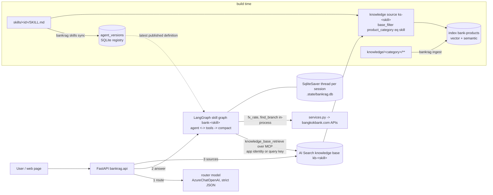

# Architecture

## Components

## Request flow (`POST /chat`)

1. **Route.** The message, the last user turns and the previous skill go to the router model (`ROUTER_MODEL`) with the published `bank-router` instructions and a strict JSON schema `{skill_id, confidence, language, reason}`. Low-confidence follow-ups stay on the previous skill; `offtopic` returns a canned reply without touching the thread. If the model call fails, a keyword fallback picks a skill.
2. **Retrieve.** As soon as the skill is known, one `retrieve` call on its knowledge base (the REST action, about a second) fetches up to eight chunks for the question. The same documents feed the model and fill the Sources card, so nothing is fetched twice.
3. **Answer.** The chosen skill's LangGraph graph runs on the session's thread (`SqliteSaver`, thread id in `sessions.conversation_id`). Its `agent` node calls the skill's model with the published instructions, a reply-language note, the customer's location note and the retrieved documents placed right before the question, so in the common case one model call writes the answer. The model keeps `knowledge_base_retrieve` bound (REST by default, the base's MCP endpoint with `KB_TRANSPORT=mcp`) for what the prefetch did not cover, such as a follow-up about another product, plus any live-service tools (`fx_rate`, `find_branch`, called in-process); when nothing was prefetched it is told to search first. Tool rounds are capped; `compact` then removes the turn's tool traffic from the thread so only the question and the answer stay. Tokens stream to the browser as they are produced, and the prefetch is recorded on the trace like any other retrieval.
4. **Cite.** Inline `[title](url)` links in the answer, and any `【n:m†title】` markers the model echoes, are resolved against the retrieved documents (or by one index lookup) into citations.

Supervisor mode (`ORCHESTRATION_MODE=supervisor`) replaces step 1: one graph per session whose `concierge` node (the published `bank-concierge` instructions, `CONCIERGE_MODEL`) is bound to one `handoff_to_<skill>` tool per skill. A handoff runs that skill's graph statelessly inside the `specialist` node and its answer streams straight to the customer; the trace carries a `handoff` block with the specialist's own usage and cost. Small talk is answered by the concierge itself.

## Data model

Index `bank-products` (one index for every product category):

| field | type | notes |
|---|---|---|
| id | key | sha1(doc_id#chunk_index) |
| doc_id | string, filterable | `category/relative/path.md` |
| content | searchable, `th.microsoft` | breadcrumb + chunk text |
| content_vector | 3072 floats, `stored=false` | text-embedding-3-large, HNSW, vectorizer for query-time embedding |
| title, breadcrumb | searchable | semantic title/keywords |
| product_category | filterable, facetable | == skill product_category |
| product_name, doc_type, language | filterable, facetable | doc_type: product-page, pdf, promotion, terms |
| source_url, source_file, chunk_index, last_updated, content_hash | | citations and incremental ingest |

Knowledge objects per skill: knowledge source `ks-<id>` (search-index kind, `base_filter` = `product_category eq '<category>'`, `general` has no filter) and knowledge base `kb-<id>` (`retrieval_reasoning_effort` minimal by default; `low`/`medium` adds an LLM using the Azure OpenAI key).

## Sessions and traces

`POST /chat` loads or creates a session (SQLite `.state/bankrag.db`), rehydrates a `ChatSession` (LangGraph thread id, history, previous skill), routes, runs the skill graph with a reply-language note in the system prompt, then stores both turns. The graph's prompt holds the last `HISTORY_TURNS` question/answer pairs of the thread plus a short recap of older ones (`trace.conversation.trimmed` counts the dropped pairs), so input tokens stay bounded however long the chat runs; a record whose thread has no checkpoint yet (a conversation from before the LangGraph memory, or a restored backup) is re-seeded from its stored turns on the next question. The checkpoint tables (`checkpoints`, `writes`) live in the same file as the sessions and travel with the backup; deleting a session deletes its thread. Each assistant turn carries a `trace`: timings per phase, router/agent token usage (input, output, cached, reasoning), retrieval calls/chunks/tokens, query variants and reasoning summaries; the `turns` table exposes these columns for analysis and `GET /sessions/stats` aggregates them.

## Ingest

`knowledge/<category>/**/*.md|*.pdf` -> metadata (frontmatter > `doc.yaml` > derived) -> clean (site chrome, images, duplicates) -> heading-aware chunks (~450 tokens, max 700, breadcrumb prefix) -> embeddings -> `mergeOrUpload`. `.state/ingest_manifest.json` stores per-document sha256 and chunk ids, so re-runs only touch changed or removed files.

Long actions run as in-memory jobs (`api._start_job`). Besides a log, each job carries structured progress (`phase`, `done`, `total`, `message`, `stats`) that ingest, crawl and URL import report through `ingest/progress.report`; `GET /jobs/{id}` polls one job and `GET /jobs?kind=` lists recent ones. The Studio Knowledge tab renders this as a phase stepper (scan, embed, upload; crawl and fetch for crawl/import), progress bar, counters, log and recent-run list.

## Sync

`bankrag skills sync` is idempotent: for each skill it upserts the knowledge source and knowledge base, then computes a hash of the desired agent definition (`AgentDefinition`: model, composed instructions, tool refs) and publishes a new version in the SQLite `agent_versions` table only if the hash of the latest version differs. The concierge and the router are republished last because their tool list / enum depend on the skill set. The runtime answers with the latest published version, so an edit reaches the assistant only after a sync; before the first sync it composes the definition live. Studio's Versions pane reads the same table (`GET /skills/{id}/versions[/{v}]`).

## Eval reports

`eval_report.py` turns a stored run into an Excel workbook (Summary + Results sheets; PASS/FAIL colouring, filters, frozen header) and the run history into one workbook with a `Runs` overview sheet plus one sheet per run. Routes: `GET /evals/runs/{id}.xlsx`, `GET /evals/runs.xlsx`, `DELETE /evals/runs/{id}`.

## Quality evals (DeepEval, LLM-as-judge)

`quality_eval.py` runs each question through the real pipeline, then scores the answer with DeepEval metrics judged by a Foundry / Azure OpenAI deployment (`JUDGE_MODEL`, default gpt-4.1-mini, key from `.env`). The retrieval context is the full text the agent received from the knowledge-base tool (`Answer.retrieval_context`, never persisted). RAG metrics: faithfulness, answer relevancy, contextual relevancy, contextual precision and recall (the last two need an expected answer). Agentic metrics: tool correctness (the `knowledge_base_retrieve` call must happen), task completion, and two G-Eval rubrics for language & customer tone and for no personal advice. A question passes when every scored metric reaches the threshold. Runs are stored like the other sets and export to xlsx with one score and one reason column per metric. Question set: `evals/quality_questions.yaml`; route `POST /evals/quality`.

## Conversation review

`sessions.question_rows` flattens every customer question with its answer, skill, language, cost, latency and feedback (search, skill, rating and source filters). The Studio Conversations tab lists these rows with checkboxes; the selection box exports the chosen questions to xlsx (`POST /conversations/export.xlsx`) or appends them to an eval set (`POST /evals/{set}/append`, duplicates by question text skipped) so real customer questions become regression cases.

A 👎 in either chat UI (the customer app and the external page) opens a comment box with multi-select reasons (wrong information, did not answer the question, not enough detail, hard to understand, wrong language or tone, too slow) and an optional note. The rating is saved at once so it is never lost, and the comment follows as `Label; Label — note`, with English labels whatever the UI language, so the Conversations tab can group and filter them; the box reopens from an *edit* link with the saved choices. In Studio the Conversations tab shows the reasons as pills and the note beside each question, and `GET /conversations/questions?comment=` filters by `any` (has a comment), `none` (rated without one) or a reason label; the text search (`q`) also matches comments.

## Bundles and question files

A bundle zip carries skills/, knowledge/ (PDFs optional), evals/ and config (pricing.yaml, settings.json). `bundle.inspect_bundle` previews new / changed / same files against the local copy; `import_bundle` writes only the wanted parts and reports the skills and knowledge categories that changed so `POST /bundle?ingest=1&sync=1` can re-ingest those categories and re-sync the agents as one job. Eval question sets round-trip through xlsx or CSV (`GET /evals/{set}.xlsx`, `POST /evals/{set}/upload?mode=append|replace`; header names are matched loosely, a headerless file is read as one question per row).

## Who asked

`api.identity` reads the Easy Auth headers (`x-ms-client-principal`, `x-ms-client-principal-name`) to get the signed-in name and email. New sessions record `user_name` / `user_email`, every user turn records `by`, and the mobile app greets with the SSO first name. Studio shows the name on the question list, the session list and the transcript, filters by user, and the xlsx export carries an 'Asked by' column. Without SSO (local dev) the fields stay empty and the Studio tester name is whatever was typed at sign-in.

## Studio access by identity

With Easy Auth in front of the app, `api.studio_role` decides Studio access from the Entra identity alone: the `studio_access` table (SQLite, backed up with the sessions DB) maps email to `admin`, `tester` or `external`. Admins manage the list in Settings > Access (`GET/POST /access`, `DELETE /access/{email}`); guards stop removing yourself, the last admin, or any account seeded from the environment (it would be re-created on the next start; change the variable instead). `STUDIO_ADMINS`, `STUDIO_TESTERS` and `STUDIO_EXTERNALS` (comma-separated emails) seed the table at start so nobody is locked out; once the list has at least one entry, the shared password is no longer accepted for SSO users. Without SSO (local dev, curl basic auth) `STUDIO_PASSWORD` grants admin as before. Signed-in people who are not on the list get a no-access page and can still use the customer app.

The `external` role is for people outside the team (a partner, a business reviewer) who should try the assistant with its trace but never see the workbench: `/` serves them `external.html` in place of the customer app (and `/studio` shows them the no-access page), a page with its own design and script (`external.css`, `external.js`; nothing shared with the customer app but `trace.js` and the public routes): a workspace with the person's conversation list, a transcript column, voice input, feedback, an EN/ไทย switch in the top bar for the page's own wording (remembered per browser; the first visit follows the browser language, and answers still follow the language of each question), an *Export chat log to Excel* link (`GET /sessions/export.xlsx`: the signed-in person's own conversations with answers, ratings, dislike reasons and comments, on a "Chat log" and a "Feedback" sheet), and a "how this answer was produced" block under each answer that can be opened by default with the *Show details* switch. Every conversation it starts is tagged `source=external` so Studio can filter them. `require_studio` refuses the role with 403, so every Studio route (skills, knowledge, evals, conversations, settings, access) is closed to them, and for session visibility they count as app users, not staff: their own conversations only, no `?all=1`.

### Roles

| Action | external | tester | admin |
|---|---|---|---|
| Open the chat web page (`/` for externals, in place of the customer app; `/studio` is refused): chat with voice input, history and a how-it-was-produced panel, own conversations only | yes | no (they get Studio) | no (they get Studio) |
| Speech mode: a voice call with the 3D persona (`/` for externals, `/talk` for everyone signed in) | yes | yes | yes |
| Open Studio, view every tab except Access | no | yes | yes |
| Skills: create, edit, save, sync one or all, upload zip, playground, versions and restore | no | yes | yes |
| Skills: delete a skill (and its published versions / knowledge base), prune | no | no | yes |
| Knowledge: upload, crawl, import URLs, incremental ingest, re-ingest one file, chunk browser, search | no | yes | yes |
| Knowledge: delete a file, full re-ingest of a category | no | no | yes |
| Evals: edit question sets, upload xlsx/csv, run routing / grounded / quality / comparison, export, delete runs | no | yes | yes |
| Conversations: review, rate, comment, selection box, export, send to evals | no | yes | yes |
| Conversations: delete a conversation | no | no | yes |
| Settings: usage, prices, base rules, runtime settings (read) and bundle export | no | yes | yes |
| Settings: change prices, base rules, runtime settings; import a bundle; manage Access | no | no | yes |

The server enforces this (`require_studio` refuses the external role, `require_admin` on the admin routes, plus checks for `full=true` ingest and `prune=true` sync); the Studio hides the same controls for testers.

### Session visibility

In the customer app, `GET /sessions` returns only the signed-in person's conversations (matched by email, or by name for sessions saved before emails were recorded) and `GET /sessions/{id}`, `/chat` on an existing session and `/chat/{id}/reset` refuse other people's sessions with 403. Studio members (tester or admin) may open any session and can pass `?all=1` to list them all (the external role may not); Studio's Conversations tab uses the review endpoints, which already cover everyone. Without SSO (local dev) nothing is filtered.

## Speech mode (a voice call with the persona)

`realtime.py` + `voice.js` + `avatar.js` add a spoken channel beside the text one. The browser holds the call itself:
it opens a WebRTC connection straight to the Azure OpenAI realtime deployment (`REALTIME_DEPLOYMENT`, default
`gpt-realtime-2.1`), so the audio never passes through the app and a spoken reply comes back in about a second. The app
keeps the three things that matter:

- `POST /realtime/session` mints a short-lived key (`{AOAI_ENDPOINT}/openai/v1/realtime/client_secrets`, account key or
  managed identity) with the session already configured: the persona (`skills/_base` personalised, the Responsible
  Lending block, and a speech addendum that forbids markdown, citations and read-out URLs and asks for one to three
  spoken sentences), the voice (`REALTIME_VOICE`, default `cedar`), semantic turn detection, transcription, and the
  tools. The browser never receives the credential or the instructions, and cannot change them.
- `POST /realtime/tool` answers every tool the model calls: `search_bank_knowledge(query, topic)` retrieves from the
  same knowledge base that skill's text agent uses (`synced_kb_owners` → `kb_tools.rest_retrieve`, trimmed to 1200
  characters per document), and `fx_rate` / `find_branch` are the same live-service bodies the agents and `/mcp/services`
  call. One search tool with a topic enum rather than one per skill: no routing round-trip inside a voice loop, and the
  model picks the topic from the same skill descriptions the router reads. Coordinates come from the page, never the model.
- `POST /realtime/turns` stores what was said as an ordinary `SessionRecord` with `source=voice`, one `Turn` pair per
  exchange, carrying the tool calls, the references and the realtime usage, so a call appears in the person's history
  and in Studio's conversation review, and can be continued in text.

The face is `avatar.js`: a GLB rendered with TalkingHead when `REALTIME_AVATAR_URL` points at one, otherwise a stylized
banker built from three.js primitives, so speech mode needs no asset. Both mouths are driven by HeadAudio (MIT, vendored
in `web/headaudio/`), an AudioWorklet that classifies the model's own audio into Oculus visemes about 50 ms behind the
sound — no text, no timings, no language model, which is why the lip-sync follows Thai as well as English.

`GET /talk` serves the same page to anyone signed in, so admins and testers reach speech mode from the customer app's
top bar or from Studio; the external role already has it at `/`.

## Supervisor mode (in-process handoff)

`supervisor.py` builds the `bank-concierge` definition (one `{"type": "handoff", "skill_id": ...}` tool ref per skill) and `graph.build_supervisor_graph` runs it: `concierge` -> `specialist` (the chosen skill's graph, stateless) -> `compact`. `ChatSession._ask_supervisor` is used when `ORCHESTRATION_MODE=supervisor`: no local router, the specialist's tokens stream to the customer, the handoff and the knowledge-base calls land in `tool_calls`, and the trace carries `handoff` (`mode`, `concierge`, `specialist`, `calls`), `usage.specialist` and `cost.specialist` immediately (this replaced the Foundry A2A relay, whose specialist usage had to be read back from Application Insights minutes later).

## Responsible Lending

`rules.py` loads `rules/<pack>/` (PACK.md product taxonomy + one file per rule) and applies it twice: `prompt_block_for_skill` / `prompt_block_for_concierge` are compiled into the agent instructions at sync time (part of the hashed definition, so a rule change re-versions the affected agents), and `guard()` runs over every drafted answer in both `ask_stream` and `_ask_supervisor` — it detects the regulated product families in the question and answer, evaluates the active rules covering them, appends missing mandatory warnings verbatim (streamed as one more delta) and writes the findings to `trace.compliance`. `rules_xlsx.py` merges the compliance team's sheet into the files, keeping how each rule is checked. Routes: `GET /rules`, `GET /rules/prompt`, `POST /rules/check`, `PUT /rules/{id}` (admin), `GET /rules.xlsx`, `POST /rules/import` (admin); Studio → Settings → Responsible lending. See [responsible-lending.md](responsible-lending.md).

## Live services (FX, branches)

`services.py` calls the public bangkokbank.com JSON APIs the website uses (exchange rates today, province/country lookups) with the site's APIM subscription value from `BBL_API_KEY`, through curl_cffi Chrome impersonation because the site is behind Akamai; responses are normalised defensively and the raw JSON is kept. `tools.py` wraps them as LangChain tools (`fx_rate`, `find_branch`) that the skill graphs call in-process; a skill opts in with `tools:` in its frontmatter and `sync.services_tool_refs` puts a `{"type": "function"}` ref in its definition. `bank-services` is the skill that carries them, and a skill with tools but no documents gets `TOOL_ONLY_NOTE` instead of the empty-knowledge-base refusal. `mcp_server.py` serves the same tool bodies over stateless streamable HTTP at `/mcp/services` for external MCP clients.

Auth for `/mcp/services`: in Azure the path stays behind Easy Auth and the app pins the caller's object id to `MCP_CALLER_PRINCIPALS` (Easy Auth alone would admit any tenant user). `MCP_TOOL_KEY` is the local-dev guard where there is no Easy Auth. `infra/13-services-tool.sh` sets the container variables. Two integration details the transport forces: Starlette's `Mount` does not run a mounted app's lifespan (the parent lifespan runs the inner app's, or the task group never starts), and DNS-rebinding protection validates `Host`, so allowed hosts come from `PUBLIC_BASE_URL`.
