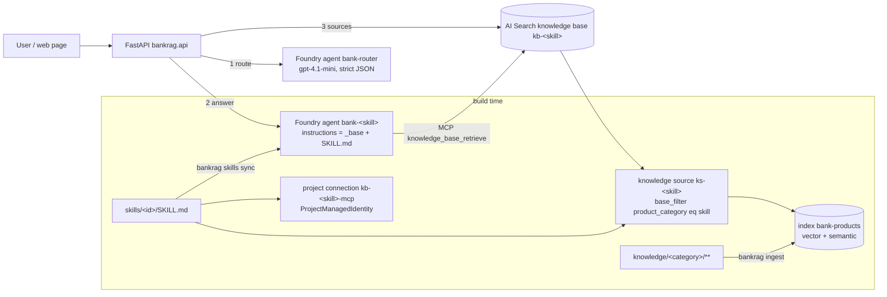

# Architecture

## Components

## Request flow (`POST /chat`)

1. **Route.** The message, the last user turns and the previous skill are sent to the `bank-router` agent, whose output is a strict JSON object `{skill_id, confidence, language, reason}`. Low-confidence follow-ups stay on the previous skill; `offtopic` returns a canned reply without retrieval. If the router agent is unreachable, a keyword fallback picks a skill.
2. **Answer.** The chosen skill agent (`bank-<skill>`) runs through the Foundry Responses API on a per-session conversation (`agent_reference` per call, one conversation shared by all skills). The agent's MCP tool calls `knowledge_base_retrieve` on its knowledge base; the model writes the answer with citations.
3. **Sources.** The API also calls the knowledge base `retrieve` action directly to return references with real `source_url`s (citations from search-index knowledge sources otherwise point at the MCP endpoint).

## Data model

Index `bank-products` (one index for every product category):

| field | type | notes |
|---|---|---|
| id | key | sha1(doc_id#chunk_index) |
| doc_id | string, filterable | `category/relative/path.md` |
| content | searchable, `th.microsoft` | breadcrumb + chunk text |
| content_vector | 3072 floats, `stored=false` | text-embedding-3-large, HNSW, vectorizer for query-time embedding |
| title, breadcrumb | searchable | semantic title/keywords |
| product_category | filterable, facetable | == skill product_category |
| product_name, doc_type, language | filterable, facetable | doc_type: product-page, pdf, promotion, terms |
| source_url, source_file, chunk_index, last_updated, content_hash | | citations and incremental ingest |

Knowledge objects per skill: knowledge source `ks-<id>` (search-index kind, `base_filter` = `product_category eq '<category>'`, `general` has no filter) and knowledge base `kb-<id>` (`retrieval_reasoning_effort` minimal by default; `low`/`medium` adds an LLM using the Azure OpenAI key).

## Sessions and traces

`POST /chat` loads or creates a session (SQLite `.state/bankrag.db`), rehydrates a `ChatSession` (Foundry conversation id, history, previous skill), routes, calls the skill agent with a developer-role reply-language note, then stores both turns. Each assistant turn carries a `trace`: timings per phase, router/agent token usage (input, output, cached, reasoning), retrieval calls/chunks/tokens, query variants and reasoning summaries; the `turns` table exposes these columns for analysis and `GET /sessions/stats` aggregates them.

## Ingest

`knowledge/<category>/**/*.md|*.pdf` -> metadata (frontmatter > `doc.yaml` > derived) -> clean (site chrome, images, duplicates) -> heading-aware chunks (~450 tokens, max 700, breadcrumb prefix) -> embeddings -> `mergeOrUpload`. `.state/ingest_manifest.json` stores per-document sha256 and chunk ids, so re-runs only touch changed or removed files.

Long actions run as in-memory jobs (`api._start_job`). Besides a log, each job carries structured progress (`phase`, `done`, `total`, `message`, `stats`) that ingest, crawl and URL import report through `ingest/progress.report`; `GET /jobs/{id}` polls one job and `GET /jobs?kind=` lists recent ones. The Studio Knowledge tab renders this as a phase stepper (scan, embed, upload; crawl and fetch for crawl/import), progress bar, counters, log and recent-run list.

## Sync

`bankrag skills sync` is idempotent: for each skill it upserts the knowledge source and knowledge base, the project connection, then computes a hash of the desired agent definition and creates a new agent version only if the hash stored in the latest version's metadata differs. The router agent is rebuilt last because its enum depends on the skill set.

## Eval reports

`eval_report.py` turns a stored run into an Excel workbook (Summary + Results sheets; PASS/FAIL colouring, filters, frozen header) and the run history into one workbook with a `Runs` overview sheet plus one sheet per run. Routes: `GET /evals/runs/{id}.xlsx`, `GET /evals/runs.xlsx`, `DELETE /evals/runs/{id}`.

## Quality evals (DeepEval, LLM-as-judge)

`quality_eval.py` runs each question through the real pipeline, then scores the answer with DeepEval metrics judged by a Foundry / Azure OpenAI deployment (`JUDGE_MODEL`, default gpt-4.1-mini, key from `.env`). The retrieval context is the full text the agent received from the knowledge-base tool (`Answer.retrieval_context`, never persisted). RAG metrics: faithfulness, answer relevancy, contextual relevancy, contextual precision and recall (the last two need an expected answer). Agentic metrics: tool correctness (the `knowledge_base_retrieve` call must happen), task completion, and two G-Eval rubrics for language & customer tone and for no personal advice. A question passes when every scored metric reaches the threshold. Runs are stored like the other sets and export to xlsx with one score and one reason column per metric. Question set: `evals/quality_questions.yaml`; route `POST /evals/quality`.

## Conversation review

`sessions.question_rows` flattens every customer question with its answer, skill, language, cost, latency and feedback (search, skill, rating and source filters). The Studio Conversations tab lists these rows with checkboxes; the selection box exports the chosen questions to xlsx (`POST /conversations/export.xlsx`) or appends them to an eval set (`POST /evals/{set}/append`, duplicates by question text skipped) so real customer questions become regression cases.

## Bundles and question files

A bundle zip carries skills/, knowledge/ (PDFs optional), evals/ and config (pricing.yaml, settings.json). `bundle.inspect_bundle` previews new / changed / same files against the local copy; `import_bundle` writes only the wanted parts and reports the skills and knowledge categories that changed so `POST /bundle?ingest=1&sync=1` can re-ingest those categories and re-sync the agents as one job. Eval question sets round-trip through xlsx or CSV (`GET /evals/{set}.xlsx`, `POST /evals/{set}/upload?mode=append|replace`; header names are matched loosely, a headerless file is read as one question per row).

## Who asked

`api.identity` reads the Easy Auth headers (`x-ms-client-principal`, `x-ms-client-principal-name`) to get the signed-in name and email. New sessions record `user_name` / `user_email`, every user turn records `by`, and the mobile app greets with the SSO first name. Studio shows the name on the question list, the session list and the transcript, filters by user, and the xlsx export carries an 'Asked by' column. Without SSO (local dev) the fields stay empty and the Studio tester name is whatever was typed at sign-in.

## Studio access by identity

With Easy Auth in front of the app, `api.studio_role` decides Studio access from the Entra identity alone: the `studio_access` table (SQLite, backed up with the sessions DB) maps email to `admin`, `tester` or `external`. Admins manage the list in Settings > Access (`GET/POST /access`, `DELETE /access/{email}`); guards stop removing yourself, the last admin, or any account seeded from the environment (it would be re-created on the next start; change the variable instead). `STUDIO_ADMINS`, `STUDIO_TESTERS` and `STUDIO_EXTERNALS` (comma-separated emails) seed the table at start so nobody is locked out; once the list has at least one entry, the shared password is no longer accepted for SSO users. Without SSO (local dev, curl basic auth) `STUDIO_PASSWORD` grants admin as before. Signed-in people who are not on the list get a no-access page and can still use the customer app.

The `external` role is for people outside the team (a partner, a business reviewer) who should try the assistant with its trace but never see the workbench: `/` serves them `external.html` in place of the customer app (and `/studio` shows them the no-access page), a page with its own design and script (`external.css`, `external.js`; nothing shared with the customer app but `trace.js` and the public routes): a workspace with the person's conversation list, a transcript column, voice input, feedback, and a "how this answer was produced" block under each answer that can be opened by default with the *Show details* switch. Every conversation it starts is tagged `source=external` so Studio can filter them. `require_studio` refuses the role with 403, so every Studio route (skills, knowledge, evals, conversations, settings, access) is closed to them, and for session visibility they count as app users, not staff: their own conversations only, no `?all=1`.

### Roles

| Action | external | tester | admin |
|---|---|---|---|
| Open the chat web page (`/` for externals, in place of the customer app; `/studio` is refused): chat with voice input, history and a how-it-was-produced panel, own conversations only | yes | no (they get Studio) | no (they get Studio) |
| Open Studio, view every tab except Access | no | yes | yes |
| Skills: create, edit, save, sync one or all, upload zip, playground, versions and restore | no | yes | yes |
| Skills: delete a skill (and its Foundry agent / knowledge base), prune | no | no | yes |
| Knowledge: upload, crawl, import URLs, incremental ingest, re-ingest one file, chunk browser, search | no | yes | yes |
| Knowledge: delete a file, full re-ingest of a category | no | no | yes |
| Evals: edit question sets, upload xlsx/csv, run routing / grounded / quality / comparison, export, delete runs | no | yes | yes |
| Conversations: review, rate, comment, selection box, export, send to evals | no | yes | yes |
| Conversations: delete a conversation | no | no | yes |
| Settings: usage, prices, base rules, runtime settings (read) and bundle export | no | yes | yes |
| Settings: change prices, base rules, runtime settings; import a bundle; manage Access | no | no | yes |

The server enforces this (`require_studio` refuses the external role, `require_admin` on the admin routes, plus checks for `full=true` ingest and `prune=true` sync); the Studio hides the same controls for testers.

### Session visibility

In the customer app, `GET /sessions` returns only the signed-in person's conversations (matched by email, or by name for sessions saved before emails were recorded) and `GET /sessions/{id}`, `/chat` on an existing session and `/chat/{id}/reset` refuse other people's sessions with 403. Studio members (tester or admin) may open any session and can pass `?all=1` to list them all (the external role may not); Studio's Conversations tab uses the review endpoints, which already cover everyone. Without SSO (local dev) nothing is filtered.

## Native Foundry: registry and A2A handoff

`foundry_native.py` runs inside `sync_skills`: publish each skill to the Foundry Skills API (hash-guarded, default version promoted) and the `bankrag-skills` toolbox; enable incoming A2A on each skill agent with an agent card; create `a2a-<id>` RemoteA2A connections; maintain the `bank-concierge` prompt agent whose tools are one `A2APreviewTool` per specialist. `ChatSession._ask_concierge` is used when `ORCHESTRATION_MODE=a2a`: no local router, the concierge streams its reply, A2A items land in `tool_calls`, the specialist is inferred from the A2A item fields and the trace carries a `handoff` block. Registry routes: `GET /registry/skills`, `GET /registry/skills/{name}`, `POST /registry/import`.

## Handoff usage reconciliation

`observability.py` queries Application Insights (`APPINSIGHTS_APP_ID`, Entra token, Monitoring Reader) for the spans sharing the concierge response's operation, summarises tokens per agent and writes `usage.specialist`, the combined `usage.total`, `cost.specialist` and `timings_ms.specialist` into the stored turn. `api.reconcile_pending` runs in a thread every 90 s over turns flagged `handoff.usage_pending`; `POST /sessions/{id}/reconcile` does it on demand.

## Responsible Lending

`rules.py` loads `rules/<pack>/` (PACK.md product taxonomy + one file per rule) and applies it twice: `prompt_block_for_skill` / `prompt_block_for_concierge` are compiled into the agent instructions at sync time (part of the hashed definition, so a rule change re-versions the affected agents), and `guard()` runs over every drafted answer in both `ask_stream` and `_ask_concierge` — it detects the regulated product families in the question and answer, evaluates the active rules covering them, appends missing mandatory warnings verbatim (streamed as one more delta) and writes the findings to `trace.compliance`. `rules_xlsx.py` merges the compliance team's sheet into the files, keeping how each rule is checked. Routes: `GET /rules`, `GET /rules/prompt`, `POST /rules/check`, `PUT /rules/{id}` (admin), `GET /rules.xlsx`, `POST /rules/import` (admin); Studio → Settings → Responsible lending. See [responsible-lending.md](responsible-lending.md).

## Live services (FX, branches)

`services.py` calls the public bangkokbank.com JSON APIs the website uses (exchange rates today, province/country lookups) with the site's APIM subscription value from `BBL_API_KEY`, through curl_cffi Chrome impersonation because the site is behind Akamai; responses are normalised defensively and the raw JSON is kept. `mcp_server.py` exposes them as MCP tools (`fx_rate` today) over stateless streamable HTTP, mounted at `/mcp/services`. A skill opts in with `tools:` in its frontmatter and `foundry_sync.services_tool` attaches an `MCPTool` to that agent; `bank-services` is the skill that carries it, and a skill with tools but no documents gets `TOOL_ONLY_NOTE` instead of the empty-knowledge-base refusal.

Auth: in Azure the path stays behind Easy Auth and `connections.ensure_services_connection` creates a RemoteTool connection with `ProjectManagedIdentity` and the Easy Auth `api://<client-id>` audience, so the agent calls as the project's managed identity; the app then pins the caller's object id to `MCP_CALLER_PRINCIPALS` (Easy Auth alone would admit any tenant user). `MCP_TOOL_KEY` is the local-dev guard where there is no Easy Auth. `infra/13-services-tool.sh` sets the three container variables. Two integration details the transport forces: Starlette's `Mount` does not run a mounted app's lifespan (the parent lifespan runs the inner app's, or the task group never starts), and DNS-rebinding protection validates `Host`, so allowed hosts come from `PUBLIC_BASE_URL`.
