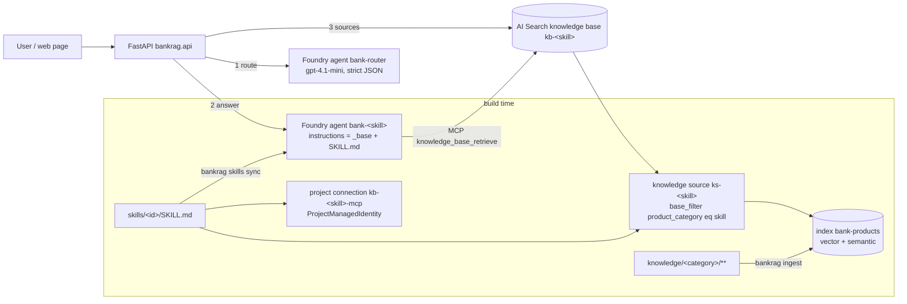

# Architecture

## Components

## Request flow (`POST /chat`)

1. **Route.** The message, the last user turns and the previous skill are sent to the `bank-router` agent, whose output is a strict JSON object `{skill_id, confidence, language, reason}`. Low-confidence follow-ups stay on the previous skill; `offtopic` returns a canned reply without retrieval. If the router agent is unreachable, a keyword fallback picks a skill.
2. **Answer.** The chosen skill agent (`bank-<skill>`) runs through the Foundry Responses API on a per-session conversation (`agent_reference` per call, one conversation shared by all skills). The agent's MCP tool calls `knowledge_base_retrieve` on its knowledge base; the model writes the answer with citations.
3. **Sources.** The API also calls the knowledge base `retrieve` action directly to return references with real `source_url`s (citations from search-index knowledge sources otherwise point at the MCP endpoint).

## Data model

Index `bank-products` (one index for every product category):

| field | type | notes |
|---|---|---|
| id | key | sha1(doc_id#chunk_index) |
| doc_id | string, filterable | `category/relative/path.md` |
| content | searchable, `th.microsoft` | breadcrumb + chunk text |
| content_vector | 3072 floats, `stored=false` | text-embedding-3-large, HNSW, vectorizer for query-time embedding |
| title, breadcrumb | searchable | semantic title/keywords |
| product_category | filterable, facetable | == skill product_category |
| product_name, doc_type, language | filterable, facetable | doc_type: product-page, pdf, promotion, terms |
| source_url, source_file, chunk_index, last_updated, content_hash | | citations and incremental ingest |

Knowledge objects per skill: knowledge source `ks-<id>` (search-index kind, `base_filter` = `product_category eq '<category>'`, `general` has no filter) and knowledge base `kb-<id>` (`retrieval_reasoning_effort` minimal by default; `low`/`medium` adds an LLM using the Azure OpenAI key).

## Sessions and traces

`POST /chat` loads or creates a session (SQLite `.state/bankrag.db`), rehydrates a `ChatSession` (Foundry conversation id, history, previous skill), routes, calls the skill agent with a developer-role reply-language note, then stores both turns. Each assistant turn carries a `trace`: timings per phase, router/agent token usage (input, output, cached, reasoning), retrieval calls/chunks/tokens, query variants and reasoning summaries; the `turns` table exposes these columns for analysis and `GET /sessions/stats` aggregates them.

## Ingest

`knowledge/<category>/**/*.md|*.pdf` -> metadata (frontmatter > `doc.yaml` > derived) -> clean (site chrome, images, duplicates) -> heading-aware chunks (~450 tokens, max 700, breadcrumb prefix) -> embeddings -> `mergeOrUpload`. `.state/ingest_manifest.json` stores per-document sha256 and chunk ids, so re-runs only touch changed or removed files.

Long actions run as in-memory jobs (`api._start_job`). Besides a log, each job carries structured progress (`phase`, `done`, `total`, `message`, `stats`) that ingest, crawl and URL import report through `ingest/progress.report`; `GET /jobs/{id}` polls one job and `GET /jobs?kind=` lists recent ones. The Studio Knowledge tab renders this as a phase stepper (scan, embed, upload; crawl and fetch for crawl/import), progress bar, counters, log and recent-run list.

## Sync

`bankrag skills sync` is idempotent: for each skill it upserts the knowledge source and knowledge base, the project connection, then computes a hash of the desired agent definition and creates a new agent version only if the hash stored in the latest version's metadata differs. The router agent is rebuilt last because its enum depends on the skill set.

## Eval reports

`eval_report.py` turns a stored run into an Excel workbook (Summary + Results sheets; PASS/FAIL colouring, filters, frozen header) and the run history into one workbook with a `Runs` overview sheet plus one sheet per run. Routes: `GET /evals/runs/{id}.xlsx`, `GET /evals/runs.xlsx`, `DELETE /evals/runs/{id}`.
